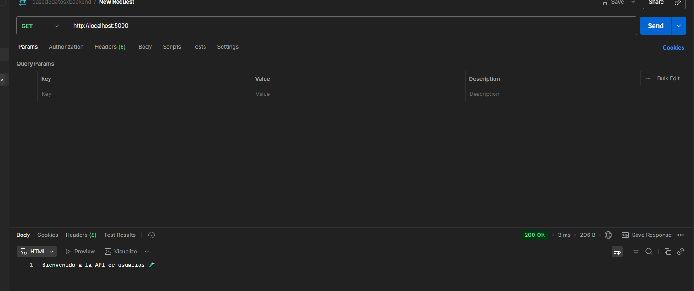
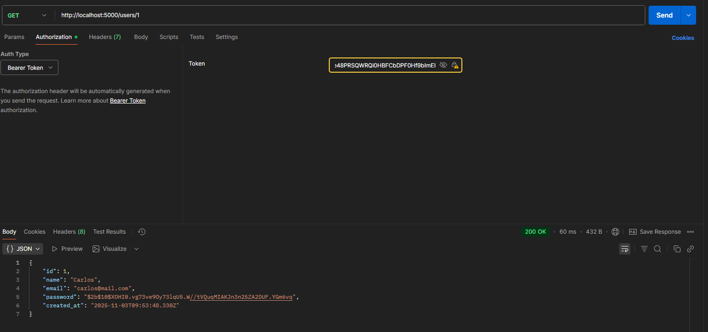
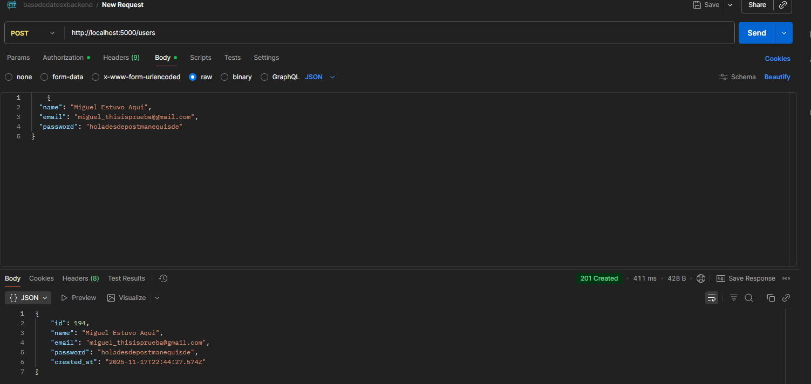
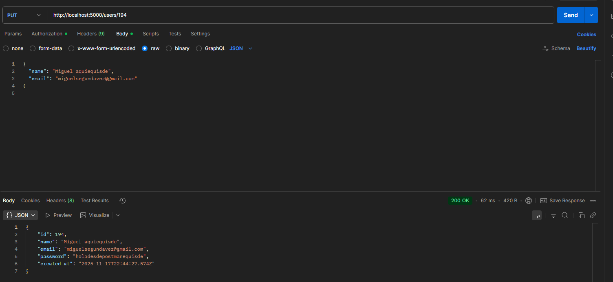
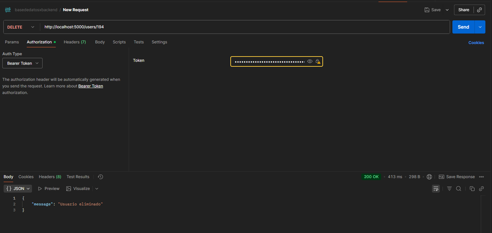

# Laboratorio8-web
GET http://localhost:5000/

GET http://localhost:5000/users

GET http://localhost:5000/users/id

POST http://localhost:5000/users

PUT http://localhost:5000/users/id

DELETE http://localhost:5000/users/id

